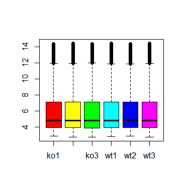
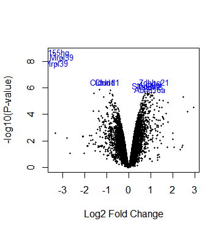

```{r setup, include=FALSE}
knitr::opts_chunk$set(echo = TRUE)
```

## Microarreglos: expresión diferencial y anotacion

Bioconductor incluye el paquete *limma* (*linear models for microarray analysis*) que nos permite descubrir genes diferencialmente expresados en un conjunto de microarreglos. Es particularmente poderoso en casos donde no se cuenta con muchas réplicas biológicas, dando buenos resultados aún cuando solamente tenemos dos replicas. En términos generales, logra esto primero estimando la variabilidad *global* de todos los genes, la cual es una medida mucho más robusta que la variabilidad de los genes individuales. Después, comprime la variabilidad de cada gen hacia la variabilidad global, lo cual reduce mucho del ruido presente en los datos de microarreglos.

``` {.r}
#Cargar las siguientes librerias
library(Biobase)
library(limma)
```

Cargar el archivo generado en la practica anterior

``` {.r}
exprs = read.table("expr_normalizada.txt", header=TRUE, row.names=1)
```

Revisar el contenido de la tabla para ver que los datos esten normalizados

``` {.r}
head(exprs) #revisa los valores numericos
boxplot(exprs, col=rainbow(6)) #genera un boxplot
```



#### Calcular expresion diferencial

Crear matrices que describan las categorias de los datos y que las comparen

``` {.r}
#crear un objeto design distinguiendo entre KO y WT
types = factor(c("KO","KO","KO","WT","WT","WT")) #vector con las etiquetas
types
#matriz que contiene las etiquetas y distingue como ceros y unos KO y WT
design = model.matrix(~ 0+types)
colnames(design) = levels(types)
design
#distingue como 1 y -1 entre KO y WT
contMatrix = makeContrasts(KO-WT, levels=design)
contMatrix
```

``` {.r}
#ajustar modelos lineales a los datos de expresion
fit  = lmFit(exprs,design)
#estimar los contrastes deseados
fit2 = contrasts.fit(fit,contMatrix)
#comprimir las varianzas hacia un valor global
fit2 = eBayes(fit2)
```

Listas de genes diferencialmente expresados

``` {.r}
topTable(fit2, number=20, sort.by="p") #los 20 mejor diferenciados por el p valor
```

#### Anotar los datos de expresion

``` {.r}
#cargar la siguiente libreria
library(mouse4302.db)
#te ayuda a identificar los genes de las sondas de los microarreglos
```

Lista de probe ids que estan en este experimento

``` {.r}
fit2 #ver la lista
head(fit2$genes) #identificar los de interes
probes = fit2$genes$ID #extraerlos

#para obtener todos los GENENAME (nombres descriptivos)
descriptions = mget(probes,mouse4302GENENAME)
#SYMBOL (nombre corto o común)
symbols = mget(probes,mouse4302SYMBOL)
#ENTREZID (identificador único) 
entrezids = mget(probes,mouse4302ENTREZID)
```

Agregar esta informacion al objeto fit2

``` {.r}
fit2$genes$EntrezID = unlist(entrezids) #unlist es necesaria para convertir las anotaciones a una columna de texto normal
fit2$genes$Symbol = unlist(symbols)
fit2$genes$Description = unlist(descriptions)
```

``` {.r}
#verificar si funciono
head(fit2$genes)
topTable(fit2, number=20, sort.by="p")
```

Interpretar los resultados con un volcano plot

``` {.r}
volcanoplot(fit2, highlight=10, names=fit2$genes$Symbol)
#Log fold-change es la significancia del cambio graficado en X
#Log Odds en el eje de las Y
```



Para ver los log fold-change mayor a 1.5 y p-value por debajo de 0.05

``` {.r .R}
deTable = topTable(fit2, number=nrow(fit2), lfc=log2(1.5), p.value=0.05)
dim(deTable)
#se pueden modificar estos valores son arbitrarios
```

``` {.r}
#tabla con todos los datos del microarreglo ordenada por logFC 
fullTable = topTable(fit2, number=nrow(fit2), sort.by="logFC")
dim(fullTable)
```

#### Guardar los resultados a un archivo

``` {.r}
write.table(fullTable, file="full_results.txt", row.names=FALSE, sep="\t", quote=FALSE)
```
